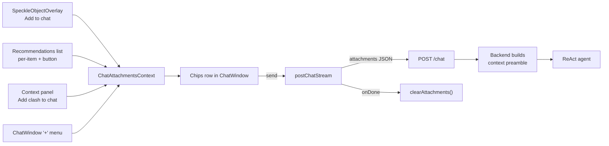

## Chat attachments — recommendations, clash + context, selected object

### UX (Cursor/Gemini-style)

- **Chip row** above the chat input in `ChatWindow`: one pill per attached item (icon + short label + `×` remove). Row is collapsible / horizontal-scroll when many. A `+` button sits inline with existing upload/send icons.
- `+` menu (popover over the chat footer) lists currently-available items; disabled rows show why (e.g. "No clash selected", "No recommendations yet"):
  - **Current clash** (`selected.label`) + its computed context objects and `context_region`.
  - **Selected object** (viewer title from `SpeckleObjectOverlay.getObjectTitle`) + its user metadata note.
  - **Recommendation #N** — one row per string in `analysisRecommendations` for the selected clash.
- **Per-source "Add to chat" buttons**:
  - `SpeckleObjectOverlay` header (next to the help icon): "Add to chat".
  - Recommendations panel: a small `+` icon beside each `<li>` in the ordered list in [ClashInspector.tsx](apps/web/src/components/inspector/ClashInspector.tsx) (around the `analysisRecommendations.map` block near line 831).
  - Context panel (clash + context bundle): a single "Add clash to chat" button in the `FloatingCard` header actions next to the existing "Show Context" button.
- **Removal**: `×` on each chip.
- **Lifecycle**: attachments are scoped to the next message — **cleared on successful send** (Cursor behavior). Aborting keeps them.
- **Styling**: reuse `rounded-lg border border-neutral-200 bg-neutral-50` (same look as existing chat input shell) with an icon per kind (clash = existing `AiIdeaIcon`-style lightbulb off, selected object = a cube/target glyph, recommendation = `AiIdeaIcon`).

### State: new `ChatAttachmentsContext`

Add `src/context/ChatAttachmentsContext.tsx`, provided at the same level as `FloatingChatProvider` in [AppLayout.tsx](apps/web/src/components/layout/AppLayout.tsx) so `ChatWindow`, inspector panels, and `SpeckleObjectOverlay` can all reach it.

```ts
export type ChatAttachment =
  | { kind: 'clash'; id: string; label: string; clash: Clash;
      clashContext: { context_region: ContextRegionPayload | null;
                      nearby_speckle_objects: NearbySpeckleObjectPayload[];
                      clash_objects_original: ClashObjectWithUserMetadata[] } }
  | { kind: 'selected_object'; id: string; label: string;
      objectData: Record<string, unknown>; userMetadata: string | null }
  | { kind: 'recommendation'; id: string; label: string;
      text: string; clashId: string; clashLabel: string }

interface ChatAttachmentsContextValue {
  attachments: ChatAttachment[]
  addAttachment(a: ChatAttachment): void   // dedupe by id
  removeAttachment(id: string): void
  clearAttachments(): void
}
```

Dedupe rule: `id` = `${kind}:${stableKey}` (e.g. `clash:<clashId>`, `selected_object:<speckleId>`, `recommendation:<clashId>:<hash(text)>`).

### Lifting `selectedObjectData` into `AppProvider`

Currently local to [ModelViewer.tsx](apps/web/src/components/inspector/ModelViewer.tsx) (line 104). Move the state onto `AppState` in [appStateContext.ts](apps/web/src/context/appStateContext.ts) as `selectedObjectData: Record<string, unknown> | null` + `setSelectedObjectData`. `ModelViewer` continues to drive it from the viewer's `SelectionExtension`, and `SpeckleObjectOverlay` now reads it from context instead of a prop. This unblocks the `+` menu and the overlay's "Add to chat" button.

### Exposing analysis results to the `+` menu

Analysis state (`analysisRecommendations`, `analysisWatchOut`, `analysisNotes`) lives in [ClashInspector.tsx](apps/web/src/components/inspector/ClashInspector.tsx). Hoist it into a small `ClashAnalysisContext` (or onto `AppState`) keyed by `clashId` so the chat `+` menu can enumerate per-recommendation rows for the currently selected clash without the chat having to traverse inspector internals.

### Chat payload: extend `POST /chat`

Update [postChatStream.ts](apps/web/src/lib/postChatStream.ts) and [chat.py](apps/api/app/routes/chat.py) with a single additive field:

```jsonc
{
  "message": "…",
  "conversation_id": "…",
  "attachments": [
    {
      "kind": "clash",
      "label": "Clash: Duct vs Beam (Level 3)",
      "clash": { /* existing Clash shape */ },
      "clash_context": {
        "context_region": { "min": {...}, "max": {...} } | null,
        "nearby_speckle_objects": [...],        // NearbySpeckleObjectPayload[]
        "clash_objects_original": [...]         // ClashObjectWithUserMetadata[]
      }
    },
    {
      "kind": "selected_object",
      "label": "Selected: Pipe-250mm",
      "speckle_id": "…",
      "object_data": { /* trimmed Record<string, unknown> */ },
      "user_metadata": "…" | null
    },
    {
      "kind": "recommendation",
      "label": "Recommendation #2 for 'Duct vs Beam'",
      "text": "…",
      "clash_id": "…",
      "clash_label": "…"
    }
  ]
}
```

Why this shape:

- **One list, discriminated by `kind`** keeps the wire format extensible without another round of renames when we later add drawings, RFIs, etc.
- **`label` on every attachment** lets the backend build a readable preamble without re-deriving it from nested fields.
- **Clash + its context are one attachment**, not two, because they're always meaningful together and the frontend already computes them as one via `buildClashContextAnalysisPayload` ([clashContextRegion.ts](apps/web/src/lib/clashContextRegion.ts)).
- **`object_data` is trimmed** on the client (reuse the `HIDDEN_KEYS` set from [SpeckleObjectOverlay.tsx](apps/web/src/components/inspector/SpeckleObjectOverlay.tsx)) so the payload stays small.
- **Size guard**: same `MAX_BODY_BYTES` approach as [postClashAnalysis.ts](apps/web/src/lib/postClashAnalysis.ts) — throw before fetch with a toast-friendly error.

### Backend handling

In [chat.py](apps/api/app/routes/chat.py):

1. Extend `ChatRequest` with `attachments: list[ChatAttachment] | None`. Define one Pydantic union per `kind` mirroring the JSON above; use `Field(discriminator="kind")`.
2. Build a deterministic preamble inside `_chat_sse_events` and send it as part of `user_msg` so memory captures it:

```
<attached_context>
[Clash] Duct vs Beam (Level 3)
  severity=CRITICAL, disciplines=…, objects=[…]
  context_region=…  nearby=12 objects
[Selected object] Pipe-250mm (id=abcd…)  user_metadata="Hold — waiting on RFI-221"
[Recommendation #2 for 'Duct vs Beam'] Re-route duct above beam flange …
</attached_context>

<user_message>
…original text…
</user_message>
```

Keep the raw JSON attached under each block (fenced JSON) so the agent can inspect structured fields when useful. No changes needed to tools or the ReAct loop.

3. No change to SSE events or `GET /chat/messages` — attachments are one-shot and already embedded in the persisted user message text.

### Data flow diagram



### Files touched

- **New**: `apps/web/src/context/ChatAttachmentsContext.tsx`, `apps/web/src/components/layout/ChatAttachmentChips.tsx`, `apps/web/src/components/layout/ChatAddContextMenu.tsx`, optional `apps/web/src/context/ClashAnalysisContext.tsx`.
- **Modified**: [appStateContext.ts](apps/web/src/context/appStateContext.ts) + [AppProvider.tsx](apps/web/src/context/AppProvider.tsx) (lift `selectedObjectData`), [ModelViewer.tsx](apps/web/src/components/inspector/ModelViewer.tsx) (use context), [SpeckleObjectOverlay.tsx](apps/web/src/components/inspector/SpeckleObjectOverlay.tsx) (remove prop, add "Add to chat" button), [ClashInspector.tsx](apps/web/src/components/inspector/ClashInspector.tsx) (hoist analysis state + add buttons in Context and Recommendations panels), [ChatWindow.tsx](apps/web/src/components/layout/ChatWindow.tsx) (chips + `+` menu + clear on success), [AppLayout.tsx](apps/web/src/components/layout/AppLayout.tsx) (mount provider), [postChatStream.ts](apps/web/src/lib/postChatStream.ts) (accept attachments), [chat.py](apps/api/app/routes/chat.py) (schema + preamble).

### Out of scope

- Persisting attachments across process restart (chat memory is already in-memory only).
- Re-rendering old attachments in historical assistant turns retrieved via `GET /chat/messages`.
- New attachment kinds beyond the three requested (drawings, RFIs, etc.) — the discriminated union is structured to support them later.