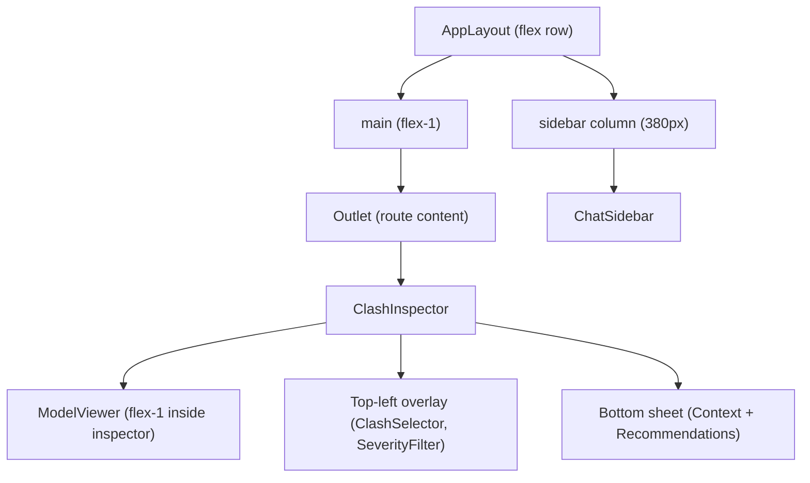
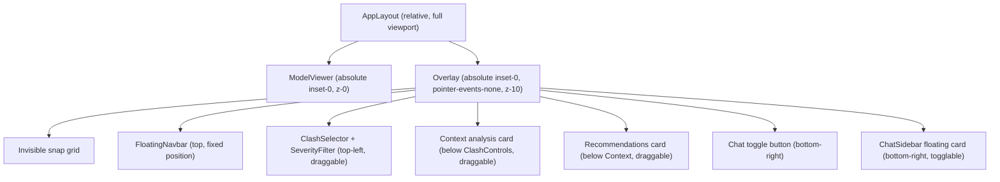

# Floating Panel UI Overhaul

## Current Architecture




## Target Architecture




## Files to Change

### 1. New shared hook: `useFloatingPanel`

**Path:** [apps/web/src/hooks/useFloatingPanel.ts](apps/web/src/hooks/useFloatingPanel.ts) (new)

A reusable hook that provides drag-to-move and snap-to-grid behavior for floating panels.

- Accepts: `panelId: string`, `initialPosition: { x, y }`, `gridSize: number` (e.g. 16px), `panelRef`
- Tracks position in state, applies via CSS `transform: translate(x, y)` for performance
- `onPointerDown` on the header starts tracking; `onPointerMove`/`onPointerUp` on `window` handles movement
- On pointer-up, snaps `x` and `y` to nearest grid multiple: `Math.round(val / gridSize) * gridSize`
- Clamps position so the panel stays within viewport bounds
- Returns `{ position, handleProps }` where `handleProps` is spread onto the draggable header element

#### Persistent layout state

Panel positions are saved to and restored from `localStorage` under a single key (`balrog-panel-layout`). The stored value is a JSON object mapping `panelId` to `{ x, y }`:

```typescript
// stored shape
interface PanelLayoutState {
  [panelId: string]: { x: number; y: number }
}
```

- **On init**: the hook reads `localStorage`, looks up `panelId`. If an entry exists and is within current viewport bounds, it uses that position; otherwise falls back to `initialPosition`.
- **On drag end (pointer-up)**: after snapping, the hook writes the updated position for this `panelId` back to `localStorage` (read-merge-write to avoid clobbering sibling panels).
- **Viewport bounds check on restore**: if the saved position would place the panel mostly off-screen (e.g. after a window resize), clamp it back into view before applying.
- A shared helper (`panelLayoutStorage.ts`) encapsulates the read/merge-write logic to keep the hook clean:

```typescript
// apps/web/src/lib/panelLayoutStorage.ts
const STORAGE_KEY = 'balrog-panel-layout'

export function readPanelLayout(): Record<string, { x: number; y: number }> { ... }
export function savePanelPosition(panelId: string, pos: { x: number; y: number }): void { ... }
```

### 2. New component: `FloatingNavbar`

**Path:** [apps/web/src/components/layout/FloatingNavbar.tsx](apps/web/src/components/layout/FloatingNavbar.tsx) (new)

- A `<nav>` positioned at the top of the overlay with `pointer-events-auto`
- Contains "Balrog" product name on the left, styled as a frosted-glass bar (`bg-white/80 backdrop-blur-md border border-neutral-200 shadow-sm rounded-xl`)
- Horizontally centered or full-width with inset margins (e.g. `mx-3 mt-3`)
- Not draggable (fixed position per requirement)

### 3. New component: `FloatingCard`

**Path:** [apps/web/src/components/ui/FloatingCard.tsx](apps/web/src/components/ui/FloatingCard.tsx) (new)

A generic wrapper that provides the draggable frosted-glass card shell:

- Renders a `<section>` with `pointer-events-auto`, `bg-white/95 backdrop-blur-sm border border-neutral-200 shadow-xl rounded-xl overflow-hidden`
- Header area: title + optional actions, acts as the drag handle (cursor-grab)
- Uses `useFloatingPanel` for positioning and snap behavior
- Props: `panelId`, `title`, `className`, `initialPosition`, `children`, `headerActions?`, `draggable?: boolean`
- `panelId` is passed through to `useFloatingPanel` for localStorage persistence

### 4. Restructure `AppLayout`

**Path:** [apps/web/src/components/layout/AppLayout.tsx](apps/web/src/components/layout/AppLayout.tsx)

Major changes:

- Remove the sidebar column entirely (chat becomes a floating card)
- Remove the resize handle logic
- The outer div becomes `relative h-svh w-full overflow-hidden` (no flex row)
- `<Outlet />` renders route content that fills the viewport
- Add the **transparent overlay layer**: a `div.pointer-events-none.absolute.inset-0.z-10` sibling after `<Outlet />`
- The overlay contains:
  - `<FloatingNavbar />` (always visible)
  - `<ChatToggle />` + `<ChatSidebar />` wrapped in a floating card (always visible, collapsed by default)
- The overlay div also establishes the **snap grid** via a CSS background pattern (invisible but used by `useFloatingPanel` for calculations -- the grid is purely computational, not visual)

### 5. New component: `FloatingChat`

**Path:** [apps/web/src/components/layout/FloatingChat.tsx](apps/web/src/components/layout/FloatingChat.tsx) (new)

Wraps the existing `ChatSidebar` in a floating card with open/close behavior:

- **Collapsed state**: a small circular button (e.g. 48x48px) in the bottom-right corner with a chat icon; `pointer-events-auto`
- **Expanded state**: a floating card (e.g. 400px wide, ~60vh tall) anchored to the bottom-right, containing the existing `ChatSidebar` content
- Toggle on click; smooth transition (scale + opacity or slide-up)
- The card is **not draggable** (per requirement: "apart from the navbar and chat")
- Chat open/close state stored in local state (or localStorage for persistence)

`ChatSidebar` itself needs minor changes:

- Remove the `<aside>` wrapper's `border-l` and height constraints (it will be inside the floating card)
- It can remain largely the same internally

### 6. Restructure `ClashInspector`

**Path:** [apps/web/src/components/inspector/ClashInspector.tsx](apps/web/src/components/inspector/ClashInspector.tsx)

Major restructuring:

- **ModelViewer becomes full viewport background**: render it as the first child with `absolute inset-0 z-0` (already `flex-1` with `relative min-h-0`; change to fill the inspector container which itself now fills the viewport)
- **Remove the bottom sheet entirely** (the `pointer-events-none absolute inset-x-0 bottom-0 z-20` section with drag handle)
- **Top-left controls** (SeverityFilter + ClashSelector + "New report" button) stay in a floating panel at top-left, wrapped in `FloatingCard` with `draggable`
- **Context analysis** becomes a separate `FloatingCard` positioned below the clash selector, draggable
- **Recommendations** becomes another `FloatingCard` below the context card, draggable
- The upload progress / error bars move into the overlay layer (small floating notification at the top)
- The context preview overlay stays as-is (it's a modal, not a floating panel)

The inspector's outer container becomes `absolute inset-0` or `h-full w-full` to fill the `<main>` area, which in turn fills the viewport.

### 7. New helper: `panelLayoutStorage`

**Path:** [apps/web/src/lib/panelLayoutStorage.ts](apps/web/src/lib/panelLayoutStorage.ts) (new)

Encapsulates all localStorage interaction for floating panel positions:

- `STORAGE_KEY = 'balrog-panel-layout'`
- `readPanelLayout()` — parses the stored JSON object; returns `{}` on missing/corrupt data
- `readPanelPosition(panelId)` — returns `{ x, y } | null`
- `savePanelPosition(panelId, pos)` — reads the full map, merges the new position for `panelId`, writes back
- Wrapped in try/catch for private browsing / quota errors (degrades to no persistence)

### 8. Snap Grid System

The snap grid is a **computational grid** (not visual by default). Define constants:

```typescript
const GRID_SIZE = 16; // 16px grid cells
```

`useFloatingPanel` uses this to snap panel positions. The overlay layer can optionally render a faint CSS-grid debug pattern during development.

### 9. Update `index.css`

**Path:** [apps/web/src/index.css](apps/web/src/index.css)

Add utility classes:

- `.floating-card` base styles (glass morphism, rounded corners)
- `.drag-handle` cursor styles

## Z-Index Strategy


| Layer                              | z-index | Content                                |
| ---------------------------------- | ------- | -------------------------------------- |
| Canvas (ModelViewer)               | 0       | Speckle 3D scene                       |
| Overlay base                       | 10      | pointer-events-none container          |
| Floating panels                    | 10-19   | navbar, clash controls, analysis cards |
| Chat floating                      | 20      | chat button + chat window              |
| Modals (settings, context preview) | 50+     | existing modal z-indices               |


## Implementation Order

The changes are best done bottom-up: shared primitives first, then restructure the containers, then wire up the panels.