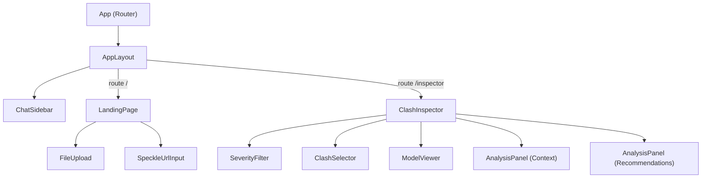

# Frontend Setup Plan

## Current State

The [apps/web/](apps/web/) directory has a scaffolded Vite + React 19 + Tailwind 4 app with only the default starter content in [apps/web/src/App.tsx](apps/web/src/App.tsx). No routing, no components, no Speckle integration.

---

## Target UI (from screenshots)

**Both views** share a two-column layout: a main content area (~~70%) on the left and a persistent chat sidebar (~~30%) on the right.

**View 1 -- Landing Page:**

- Centered card: "Get started in 3 simple steps" with instructions
- "Upload Navisworks report" button (teal, triggers file picker for `.html`/`.xml` clash reports)
- "+ Add Speckle URL" button (full-width, light gray) that reveals a text input

**View 2 -- Clash Inspector (after upload):**

- Top-left: Severity Scale Filter (range slider 0--10), clash count text, clash dropdown selector
- Center: Speckle 3D model viewer (using `@speckle/viewer` SDK)
- Bottom: Two side-by-side panels -- "Context" and "Recommendations" -- each with a "Run Analysis" button

**Chat Sidebar (persistent):**

- "Claude Opus" label at top
- Message area (UI shell only, no backend wiring)
- Text input with attachment (+) and send buttons at bottom

---

## New Dependencies

Install in [apps/web/](apps/web/):

- `**react-router-dom`** -- client-side routing between landing and inspector views
- `**@speckle/viewer`** -- 3D model viewer SDK

---

## File Structure

All new files go under `apps/web/src/`. The existing [App.css](apps/web/src/App.css) will be removed (replaced by Tailwind utility classes). [index.css](apps/web/src/index.css) will be simplified to keep only the Tailwind import and minimal base resets.

```
src/
  App.tsx                        -- Router setup, layout wrapper
  main.tsx                       -- Entry (unchanged)
  index.css                      -- Tailwind import + minimal resets

  types/
    index.ts                     -- Clash, SpeckleModel, ChatMessage types

  context/
    AppContext.tsx                -- Shared state: clashes[], speckleUrls[], severityThreshold, selectedClashId

  components/
    layout/
      AppLayout.tsx              -- Two-column flex layout (main + sidebar)
      ChatSidebar.tsx            -- Chat UI shell (messages list, input bar)

    landing/
      LandingPage.tsx            -- "Get started" card, orchestrates upload + URL inputs
      FileUpload.tsx             -- Navisworks file upload button + hidden input
      SpeckleUrlInput.tsx        -- "+ Add Speckle URL" button that expands to URL text input

    inspector/
      ClashInspector.tsx         -- Main inspector view, composes child components
      SeverityFilter.tsx         -- Range slider (0-10) + "N clashes with severity X or higher" text
      ClashSelector.tsx          -- Dropdown (select) for picking a clash by ID
      ModelViewer.tsx            -- Mounts @speckle/viewer into a container div
      AnalysisPanel.tsx          -- Reusable panel (title + content area + "Run Analysis" button)

  hooks/
    useSpeckleViewer.ts          -- Manages Viewer lifecycle (init, load URLs, cleanup) via useRef + useEffect
```

---

## Component Architecture




---

## Key Implementation Details

### 1. AppContext -- shared state

- `clashes: Clash[]` -- parsed from the uploaded Navisworks report
- `speckleUrls: string[]` -- user-provided Speckle model URLs
- `severityThreshold: number` -- current slider value (default 0)
- `selectedClashId: string | null` -- currently selected clash
- `filteredClashes` -- derived: clashes filtered by severity threshold

### 2. Speckle Viewer integration (`useSpeckleViewer` hook)

Pattern from the official SDK docs, adapted for React:

```typescript
function useSpeckleViewer(containerRef: RefObject<HTMLDivElement | null>, urls: string[]) {
  const viewerRef = useRef<Viewer | null>(null);

  useEffect(() => {
    if (!containerRef.current) return;

    const viewer = new Viewer(containerRef.current);
    viewerRef.current = viewer;

    async function init() {
      await viewer.init();
      viewer.createExtension(CameraController);
      viewer.createExtension(SelectionExtension);

      for (const speckleUrl of urls) {
        const resolved = await UrlHelper.getResourceUrls(speckleUrl);
        for (const url of resolved) {
          const loader = new SpeckleLoader(viewer.getWorldTree(), url, "");
          await viewer.loadObject(loader, true);
        }
      }
    }
    init();

    return () => { viewer.dispose(); };
  }, [urls]);

  return viewerRef;
}
```

### 3. Routing

- `/` -- renders `LandingPage` inside `AppLayout`
- `/inspector` -- renders `ClashInspector` inside `AppLayout`
- After successful upload + at least one Speckle URL, navigate to `/inspector`

### 4. Navisworks upload

`FileUpload` accepts `.html` or `.xml` files (Navisworks clash export formats). For this frontend setup, parsing logic will be a stub -- the file is stored in state and a mock clash list is generated to demonstrate the inspector UI. Real parsing will come from the API later.

### 5. Styling approach

All styling via Tailwind utility classes. The teal button color from the screenshots maps to Tailwind's `bg-teal-600`/`bg-teal-700` palette. The overall layout is a white/light background with subtle borders, matching the clean look in the screenshots.

---

## Files to Modify

- **[apps/web/package.json](apps/web/package.json)** -- add `react-router-dom` and `@speckle/viewer` dependencies
- **[apps/web/src/App.tsx](apps/web/src/App.tsx)** -- replace starter content with router + layout
- **[apps/web/src/index.css](apps/web/src/index.css)** -- simplify to Tailwind import + base resets
- **[apps/web/index.html](apps/web/index.html)** -- update `<title>` to "Project Balrog"

## Files to Remove

- **[apps/web/src/App.css](apps/web/src/App.css)** -- no longer needed (Tailwind replaces it)

## Files to Create

All 13 new files listed in the file structure above under `types/`, `context/`, `components/`, and `hooks/`.