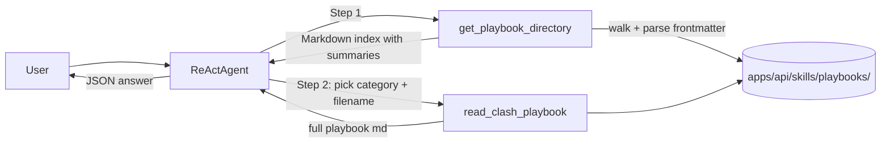

## Architecture



The two tools are registered as a single `"playbooks"` bundle in the existing tool registry in [apps/api/app/agent.py](apps/api/app/agent.py) and added to `ENABLED_AGENT_TOOL_IDS` in [apps/api/app/routes/chat.py](apps/api/app/routes/chat.py) so both `agent` and `clash_analysis_agent` (built in [apps/api/main.py](apps/api/main.py) and [apps/api/app/routes/agent_config.py](apps/api/app/routes/agent_config.py)) receive them.

## Phase 1 — Seed directory structure and frontmatter schema

Create `apps/api/skills/playbooks/` (sibling of `app/`, outside the hatch-packaged `app` module but discoverable at runtime via `Path(__file__).resolve().parents[2]`).

### Per-playbook YAML frontmatter

Every playbook `.md` starts with a short YAML frontmatter block. These are the fields the directory tool surfaces to the agent so it can pick the right playbook without reading the full file:

```markdown
---
title: Primary Beam x HVAC Main Duct
category: Structural_x_MEP
elements: [Primary Structural Beam, HVAC Main Supply/Return Duct]
applies_when: Primary steel/concrete beam conflicts with a main HVAC supply or return duct in a horizontal service plenum.
severity_default: HIGH
---

## Anchor Constraint
The primary beam is immovable (Layer B: IMMOVABLE). The duct must yield.

## Resolution Options
### Option 1 — Web penetration (preferred)
- Opening <= 40% of clear web height.
- Min distance from flange = 0.25 x beam depth.
- [ ] Structural Engineer sign-off required.
...
```

Required frontmatter keys: `title`, `category`, `elements` (list), `applies_when` (one-line trigger). Optional: `severity_default`, `aliases` (list of alternative element names for matching).

### Seed files

- `Structural_x_MEP/`
  - `Primary_Beam_x_HVAC_Main_Duct.md` — web penetration rules (<= 40% clear web height, min distance from flange = 0.25 x beam depth, SE sign-off), duct transition/offset (height reduction, velocity delta < 20%), split routing.
  - `Primary_Beam_x_Gravity_Drainage.md` — gravity slope is the anchor constraint; drainage wins; beam yields via coring limits or routing.
  - `Structural_Column_x_MEP.md` — never cut columns; route around; trapeze redirects; cable tray splits.
- `MEP_x_MEP/`
  - `HVAC_Duct_x_HVAC_Duct.md` — spiral transition in clash zone, shared plenum strategy.
  - `Pipe_x_Pipe_Drainage_Priority.md` — gravity drainage wins, shared-support (trapeze) planning.
- `Structural_x_Architecture/`
  - `Metal_Deck_x_GWB_Partition.md` — deflection head detail (25–50 mm slotted top track), fire/acoustic flute filler, never notch deck flutes.
- `MEP_x_Architecture/`
  - `Ceiling_x_MEP_Hangers.md` — hanger adjustment range, ceiling grid offset, access panel requirement.

Body content lifted and cleaned from the existing Layer C block in [apps/api/app/utils/clash_analysis_prompt.py](apps/api/app/utils/clash_analysis_prompt.py) lines 30–56.

### Optional per-category README

Each trade-category folder (e.g. `Structural_x_MEP/`) MAY contain a `README.md` with a one-sentence description of the trade pairing. If present, the directory tool surfaces its first paragraph as the category-level summary. This is optional — categories without a README still render with just their name.

## Phase 2 — Tools module

The directory tool does NOT return bare filenames. It returns a **Markdown index** built on the fly by walking the tree and parsing each playbook's frontmatter, so the agent gets both the hierarchy and a one-line "applies when" summary per playbook. Drop-in scalability is preserved because the index is generated at call time, not hand-authored.

New file `apps/api/app/tools/__init__.py` (empty) and `apps/api/app/tools/playbook_tools.py` containing:

```python
from pathlib import Path
import re
from pydantic import BaseModel, Field
from llama_index.core.tools import FunctionTool

PLAYBOOKS_ROOT = (Path(__file__).resolve().parents[2] / "skills" / "playbooks").resolve()

_FRONTMATTER_RE = re.compile(r"\A---\s*\n(.*?)\n---\s*\n", re.DOTALL)


def _parse_frontmatter(text: str) -> dict[str, str]:
    """Tiny YAML-subset parser: top-level `key: value` lines only.

    Intentionally dependency-free (no PyYAML). Lists render as their raw string;
    the agent only needs the scalar `title`, `applies_when`, `severity_default`.
    """
    m = _FRONTMATTER_RE.match(text)
    if not m:
        return {}
    out: dict[str, str] = {}
    for line in m.group(1).splitlines():
        if ":" not in line or line.lstrip().startswith("#"):
            continue
        key, _, value = line.partition(":")
        out[key.strip()] = value.strip().strip("\"'")
    return out


def _category_summary(cat_dir: Path) -> str | None:
    readme = cat_dir / "README.md"
    if not readme.is_file():
        return None
    first_para = readme.read_text(encoding="utf-8").strip().split("\n\n", 1)[0]
    return first_para.replace("\n", " ").strip()


def get_playbook_directory() -> str:
    """Return a Markdown index of trade categories and their playbooks with summaries.

    Use this FIRST to discover the correct `category` and `filename` for a clash,
    then call `read_clash_playbook` with those exact values.
    """
    if not PLAYBOOKS_ROOT.is_dir():
        return "# Clash Playbook Index\n\n_No playbooks available._"

    lines: list[str] = ["# Clash Playbook Index", ""]
    for cat in sorted(p for p in PLAYBOOKS_ROOT.iterdir() if p.is_dir()):
        lines.append(f"## {cat.name}")
        summary = _category_summary(cat)
        if summary:
            lines.append(f"_{summary}_")
        lines.append("")
        playbooks = sorted(
            f for f in cat.iterdir()
            if f.is_file() and f.suffix == ".md" and f.name != "README.md"
        )
        if not playbooks:
            lines.append("_(no playbooks yet)_")
            lines.append("")
            continue
        for pb in playbooks:
            fm = _parse_frontmatter(pb.read_text(encoding="utf-8"))
            title = fm.get("title", pb.stem.replace("_", " "))
            applies = fm.get("applies_when", "")
            severity = fm.get("severity_default", "")
            sev = f" _(default severity: {severity})_" if severity else ""
            lines.append(f"- **{pb.name}** — {title}.{sev}")
            if applies:
                lines.append(f"  - Applies when: {applies}")
        lines.append("")
    return "\n".join(lines).rstrip() + "\n"


class ReadPlaybookArgs(BaseModel):
    category: str = Field(..., description="Top-level folder, e.g. Structural_x_MEP")
    filename: str = Field(..., description="File name, e.g. Primary_Beam_x_HVAC_Main_Duct.md")


def read_clash_playbook(category: str, filename: str) -> str:
    """Read a specific playbook's full Markdown (including frontmatter)."""
    for part in (category, filename):
        if not part or ".." in part or "/" in part or "\\" in part or "\x00" in part:
            return "Invalid argument. Use get_playbook_directory() to list valid entries."
    if not filename.endswith(".md"):
        return "Filename must end with .md."
    candidate = (PLAYBOOKS_ROOT / category / filename).resolve()
    if not candidate.is_relative_to(PLAYBOOKS_ROOT) or not candidate.is_file():
        return "File not found. Check directory using get_playbook_directory()."
    return candidate.read_text(encoding="utf-8")


def playbook_tool_list() -> list[FunctionTool]:
    return [
        FunctionTool.from_defaults(get_playbook_directory),
        FunctionTool.from_defaults(read_clash_playbook, fn_schema=ReadPlaybookArgs),
    ]
```

Notes:
- The frontmatter parser is a tiny scalar-only YAML subset (no PyYAML dependency added). It handles `key: value` lines; list values like `elements: [...]` are stored raw and not currently surfaced in the index. If we later need richer parsing we can add PyYAML.
- Sanitization covers the three standard traversal vectors: `..` segments, embedded path separators, and absolute/symlink escapes (`is_relative_to` check after `.resolve()`).
- The index is rebuilt on every call — drop in a new `.md` with frontmatter and it appears immediately, no code changes.

## Phase 3 — Agent registration

In [apps/api/app/agent.py](apps/api/app/agent.py) (~line 63):

```python
from app.tools.playbook_tools import playbook_tool_list

_TOOL_BUNDLES: dict[str, Callable[[], list[FunctionTool]]] = {
    "duckduckgo": _duckduckgo_tool_list,
    "playbooks": playbook_tool_list,
}
```

In [apps/api/app/routes/chat.py](apps/api/app/routes/chat.py) line 27:

```python
ENABLED_AGENT_TOOL_IDS: list[str] = ["duckduckgo", "playbooks"]
```

Both `agent` and `clash_analysis_agent` read `ENABLED_AGENT_TOOL_IDS` (see [apps/api/main.py](apps/api/main.py) lines 44–50 and [apps/api/app/routes/agent_config.py](apps/api/app/routes/agent_config.py) lines 157–165), so no other wiring is required.

## Phase 4 — System prompt rewrite

Update [apps/api/app/utils/clash_analysis_prompt.py](apps/api/app/utils/clash_analysis_prompt.py) to make on-disk playbooks the single source of truth:

- **Remove** inline "Layer C — Element-Type Resolution Playbooks" block (current lines 30–56).
- **Insert** a new Layer C — "Playbook Retrieval Protocol" containing the mandatory two-step directive:

  > "When you receive a new clash report, you MUST resolve it using the internal engineering library. Step 1: Call `get_playbook_directory`. It returns a Markdown index of trade categories and playbooks with one-line 'Applies when' summaries — use these summaries (not guesswork) to pick the single best-matching `category` + `filename`. Step 2: Call `read_clash_playbook` with those exact values. Apply the rules from the retrieved Markdown exactly. If no playbook matches, state this explicitly and fall back to Layer B precedence reasoning."

- Layers A (Role), B (Trade Precedence Hierarchy), D (Severity), and E (JSON output schema) are kept verbatim.

## Rules honored

- No database / RAG / vector store — pure `pathlib` + `json`.
- Directory traversal blocked: `..`, `/`, `\`, null byte rejected; `Path.resolve().is_relative_to(PLAYBOOKS_ROOT)` enforced after resolution.
- New playbooks are drop-in: `get_playbook_directory` re-walks the filesystem each call, so added `.md` files are picked up without restarting or code changes.

## Suggested improvements (flagged per your request)

1. **Tool output capping** — `read_clash_playbook` should ideally cap returned bytes (e.g. 64 KB) to avoid blowing the context window if a future playbook grows large. Low-cost to add; happy to include in implementation.
2. **Case-insensitive matching** — the ReAct loop sometimes emits slightly off capitalization. We could lowercase-compare `category`/`filename` against the real directory listing and resolve to the canonical name, returning a clear error with suggestions otherwise. Optional; adds robustness.
3. **Tests** — no pytest suite exists in `apps/api/` today. I'd suggest a minimal `apps/api/tests/test_playbook_tools.py` covering: directory listing, happy-path read, traversal attempts (`..`, absolute), missing file, non-`.md` extension. Optional; say the word and I'll add it.

None of these are blockers; confirm and I'll proceed with the core plan above (and fold in 1–3 if you want them).