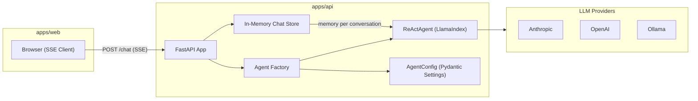

# LlamaIndex ReAct Agent API Setup

## Current State

The backend ([apps/api/main.py](apps/api/main.py)) is a bare stub with no web framework, no dependencies, and no agent code. The [pyproject.toml](apps/api/pyproject.toml) has an empty dependency list.

## Target Architecture




## File Structure

```
apps/api/
  main.py                  # FastAPI app with lifespan, mounts router
  pyproject.toml           # Dependencies
  .env.example             # API key template
  app/
    __init__.py
    config.py              # Pydantic BaseSettings for agent configuration
    agent.py               # Agent factory: builds ReActAgent from config
    chat_store.py          # In-memory conversation store (agent + memory per session)
    routes/
      __init__.py
      chat.py              # POST /chat SSE endpoint
```

## Dependencies (in [apps/api/pyproject.toml](apps/api/pyproject.toml))

- `fastapi` + `uvicorn[standard]` -- web framework and ASGI server
- `llama-index-core` -- core agent framework (includes `ReActAgent`, `ChatMemoryBuffer`, `FunctionTool`)
- `llama-index-llms-anthropic` -- default provider (Claude)
- `llama-index-llms-openai` -- optional OpenAI provider
- `sse-starlette` -- clean SSE support for FastAPI
- `pydantic-settings` -- typed configuration from env vars
- `python-dotenv` -- load `.env` file

## Implementation Details

### 1. Configuration ([app/config.py](apps/api/app/config.py))

Pydantic `BaseSettings` class sourced from environment variables (with `.env` file support):

- `llm_provider`: `"anthropic"` | `"openai"` | `"ollama"` (default: `"anthropic"`)
- `model_name`: string (default: `"claude-sonnet-4-20250514"`)
- `api_key`: string (reads from `ANTHROPIC_API_KEY` or `OPENAI_API_KEY` depending on provider)
- `system_prompt`: string (sensible default for BIM coordination assistant)
- `temperature`: float (default: `0.7`)
- `max_tokens`: int (default: `4096`)
- `tools_enabled`: list of tool identifiers (default: `[]`, extensible later)

### 2. Agent Factory ([app/agent.py](apps/api/app/agent.py))

- `create_llm(config)` -- returns the appropriate LlamaIndex LLM based on `llm_provider`
- `create_agent(config, memory)` -- builds a `ReActAgent` with the configured LLM, system prompt, tools, and a `ChatMemoryBuffer`
- Tools are resolved from `tools_enabled` via a registry dict; starts empty but is extensible

### 3. Chat Store ([app/chat_store.py](apps/api/app/chat_store.py))

- `ChatSessionStore` class holding a `dict[str, ReActAgent]` (keyed by conversation ID)
- `get_or_create(conversation_id, config)` -- returns existing agent or creates a new one with fresh memory
- `delete(conversation_id)` -- cleanup
- All data lives in-process memory; lost on restart (as specified)

### 4. SSE Chat Endpoint ([app/routes/chat.py](apps/api/app/routes/chat.py))

**Request:** `POST /chat`

```json
{
  "conversation_id": "optional-uuid",
  "message": "user message text"
}
```

**Response:** SSE stream (`text/event-stream`), events:


| Event type | Payload                      | When                                          |
| ---------- | ---------------------------- | --------------------------------------------- |
| `metadata` | `{"conversation_id": "..."}` | First event, confirms/assigns conversation ID |
| `token`    | `{"content": "..."}`         | Each streamed text chunk                      |
| `done`     | `{}`                         | Stream complete                               |
| `error`    | `{"detail": "..."}`          | On failure                                    |


Implementation flow:

1. Parse request, resolve or generate `conversation_id`
2. Get or create agent from `ChatSessionStore`
3. Call `agent.astream_chat(message)` to get a `StreamingAgentChatResponse`
4. Iterate over `response.async_response_gen()`, yield each chunk as an SSE `token` event
5. Yield `done` event

### 5. FastAPI App ([main.py](apps/api/main.py))

- Use `@asynccontextmanager` lifespan to:
  - Load `AgentConfig` from environment
  - Initialize `ChatSessionStore`
  - Store both in `app.state`
- Mount the chat router
- Add CORS middleware for frontend dev (`http://localhost:5173`)
- Health check at `GET /health`

### 6. Environment Template ([.env.example](apps/api/.env.example))

```
ANTHROPIC_API_KEY=sk-ant-...
OPENAI_API_KEY=sk-...
LLM_PROVIDER=anthropic
MODEL_NAME=claude-sonnet-4-20250514
SYSTEM_PROMPT=
TEMPERATURE=0.7
MAX_TOKENS=4096
```

## What This Does NOT Cover (future work)

- Frontend SSE client integration (the endpoint is ready for any SSE client)
- Persistent chat storage (database-backed)
- Custom tools (the registry is in place but starts empty)
- Authentication / rate limiting

